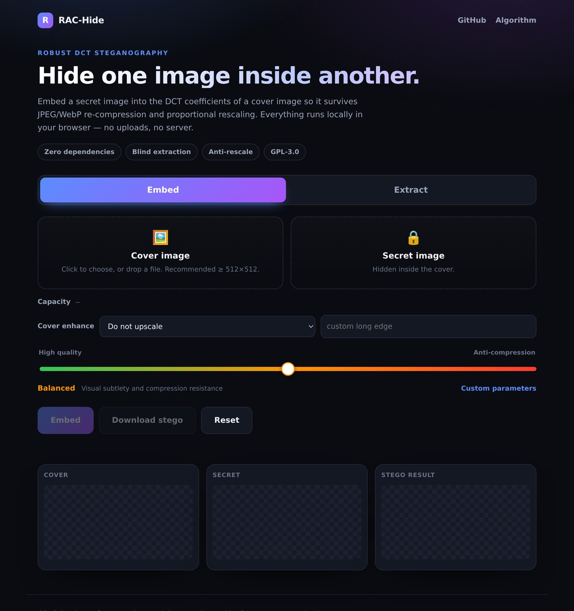

<div align="center">

# 图隐 Tuyin

**RAC-Hide 图片隐写的 Android App 化版本** · *Android client for the robust image steganography by [tuoPzf](https://github.com/tuoPzf/rac-hide)*

[](https://github.com/Gz3192019/Tuyin/releases/latest)
[](LICENSE)

</div>

> 本仓库 fork 自 [tuoPzf/rac-hide](https://github.com/tuoPzf/rac-hide)，**仅做安卓客户端封装与 UI 适配**，隐写算法与原项目完全兼容，两端可互相解隐。原作者的算法说明与文档保留在下方，完整项目结构见[原文](#rac-hide)。

---

# RAC-Hide

**Robust Attribute Coding for images — hide one image inside another so it survives JPEG re-compression and proportional rescaling.**

[](LICENSE)

[](https://github.com/tuoPzf/rac-hide/actions/workflows/ci.yml)
[](https://tuoPzf.github.io/rac-hide/)

RAC-Hide is a dependency-free JavaScript implementation of *robust* image
steganography. A secret image is compressed to JPEG and embedded into the
**relationships between low-frequency DCT coefficients** of a cover image. The
result is visually indistinguishable from the cover and can be recovered after
the cover has passed through the lossy re-encoding pipelines used by messaging
apps and social platforms.

Everything runs locally: the library never uploads an image anywhere.

> **Dual use.** Steganography is a general information-hiding technique. This
> project is released for research, digital watermarking / copyright protection
> and lawful covert communication. Do **not** use it to distribute illegal
> content or to evade lawful moderation. See [Security and ethics](#security-and-ethics).

---

## Live demo

Try the full tool in your browser — nothing to install:

**https://tuoPzf.github.io/rac-hide/demo/**

[](https://tuoPzf.github.io/rac-hide/demo/)

The demo exposes every knob: capacity read-out, cover enhancement, the
quality ↔ anti-compression slider, custom embedding parameters, progress
feedback and previews. All computation stays on your device.

## GUI workbench (`gui/`)

A self-contained interactive workbench with drag-and-drop upload, capacity
meter, cover enhancement, three operating points plus fully custom parameters,
a channel simulator (scale + re-compress + re-extract). It supports **light /
dark mode** (follows the system, or toggle manually) and an **in-place extract
verification** button after embedding.

- Local run: `python3 -m http.server 8000` then open
  `http://localhost:8000/gui/` (ES modules need HTTP, not `file://`).
- **Install as an app on Android** (PWA): open the hosted version in Chrome,
  then use menu → "Add to Home screen" / "Install app":

  **https://4m44fw7fpsrp5.doubaoapps.com/app/app_17eq0z7tkjm**

  The hosted app is fully self-contained and works offline after first load.

## Android app — 图隐 (`android/`)

图隐 is a **pure native Android app** (no WebView) rebuilt from the workbench:
native Material cards, segmented 嵌入 / 提取 tabs, capacity / quality controls,
a MIUI X-inspired floating navigation with glass blur, and a native 关于 page
carrying the app name **图隐** and version — paying tribute to the original
author's GitHub. Storage permissions are declared for picking images and saving
exported PNGs to the system gallery; the app never connects to the network.

- **Download the latest APK from Releases**:
  <https://github.com/Gz3192019/Tuyin/releases/latest>
  (每发布一个版本，GitHub Actions 都会自动构建并发布到 Releases，tag 为 `v版本号`。)
- 注意：云端自动构建的 APK 使用 debug keystore 签名；覆盖安装前请先卸载旧版，
  如需正式签名请在仓库 `Settings → Secrets and variables → Actions` 配置
  `ANDROID_KEYSTORE_B64 / ANDROID_KEYSTORE_PASS / ANDROID_KEYSTORE_ALIAS`。
- Build from source and install steps: see [`android/README.md`](android/README.md).

---

## Why coefficient *relationships*?

JPEG quantises every DCT coefficient independently, so absolute coefficient
values are not stable under re-compression. But if two coefficients receive
almost the same quantisation step, their **difference** is stable — quantisation
shifts both members in nearly the same direction. RAC-Hide therefore encodes one
bit as the *sign* of `C1 - C2` for a carefully chosen coefficient pair, and
actively pushes that difference away from zero by an adaptive **margin**.

That single idea, plus error-correction and interleaving, is what makes the
payload survive the channel.

## Pipeline

```
EMBED
  secret image ─▶ JPEG ─▶ 11-byte header ─▶ Reed–Solomon ─▶ bit repeat ─▶ interleave
                                                                              │
  cover image ─▶ YCbCr ─▶ Cb + spatial ruler ─▶ luma ─▶ 8×8 DCT ─▶ pair modulation
                                                                              │
                                                             IDCT ─▶ RGB ─▶ stego PNG

EXTRACT
  stego image ─▶ read ruler from Cb ─▶ normalise scale ─▶ 8×8 DCT ─▶ pair differences
                                                                          │
        search (ppb, repeat, nsym) ─▶ RS decode ─▶ header check ─▶ JPEG ─▶ secret image
```

See [`docs/algorithm.md`](docs/algorithm.md) for the full design, or the
[`src/`](src) modules — each one is self-contained and documented.

## Features

- **Anti-JPEG.** Payload lives in quantisation-robust coefficient differences.
- **Anti-rescale.** A resolution-independent *spatial ruler* in the chroma
  channel lets the decoder recover the original dimensions at any scale.
- **Blind extraction.** The payload is self-describing; no original cover and no
  side channel are needed.
- **Zero dependencies.** Pure ES modules, no build step.
- **Isomorphic core.** The `src/core.js` codec runs in Node, a Web Worker or a
  browser; only `src/browser.js` touches the DOM.

## Quick start

### Node

```js
import { buildPayload, embed, extract, capacityBytes } from 'rac-hide';
import { readFile, writeFile } from 'node:fs/promises';

// `imageData` is any { data, width, height } with RGBA bytes
const cover = await loadImage('cover.png');
const secretJpeg = await readFile('secret.jpg');

const options = { ppb: 2, repeat: 1, nsym: 48 };
console.log(capacityBytes(cover.width, cover.height, options), 'bytes available');

const payload = buildPayload(secretJpeg, options);
const stego = embed(cover, payload, options);      // -> { data, width, height }
const result = extract(stego);                     // -> { jpeg, ppb, repeat, nsym }
await writeFile('recovered.jpg', result.jpeg);
```

### Browser

```js
import { embedImage, extractImage, decodeImageFile, imageDataToBlob } from 'rac-hide/browser';

const cover = await decodeImageFile(coverFile);
const secret = await decodeImageFile(secretFile);

const { stego, secretSize } = await embedImage(cover, secret, { ppb: 2, repeat: 1, nsym: 48 });
const blob = await imageDataToBlob(stego, 'image/png');

const recovered = await extractImage(await decodeImageFile(blob));
```

### Run the demo locally

The hosted demo is at **https://tuoPzf.github.io/rac-hide/demo/** (the site root
redirects there). To run it from a checkout, serve the repository over HTTP
(ES modules do not load from `file://`):

```bash
python3 -m http.server 8000
# then open http://localhost:8000/demo/
```

## Operating points

| Preset     | `ppb` | `repeat` | `nsym` | Trade-off                                        |
|------------|:-----:|:--------:|:------:|--------------------------------------------------|
| `capacity` | 6     | 1        | 32     | Largest, sharpest secret; weakest against attacks |
| `balanced` | 2     | 1        | 48     | Recommended default                              |
| `robust`   | 1     | 3        | 48     | Strongest against compression/rescaling; smallest |

| Parameter    | Effect when increased                                              |
|--------------|--------------------------------------------------------------------|
| `ppb`        | Capacity rises linearly; per-bit margin is spread thinner          |
| `repeat`     | Random-error resilience rises; capacity falls by the same factor   |
| `nsym`       | Corrects more errors; payload shrinks (RS rate `(255-nsym)/255`)   |
| `marginMin`  | Robustness rises, visibility rises                                 |
| `marginGain` | Textured blocks get larger margins (more robust, less invisible)   |
| `marginMax`  | Caps the distortion in high-energy blocks                          |

Capacity in bytes:

```
total slots   = (W/8) · (H/8) · ppb
codewords     = floor(total slots / 2040)
capacity      = floor(codewords / repeat) · (255 - nsym) - 11
```

## Robustness

Measured with the bundled test-suite and manual platform round-trips:

- Lossless for a clean embed → extract cycle, and for mild additive noise.
- The spatial ruler is recovered after proportional rescaling and JPEG/WebP
  re-compression.
- Survives aggressive JPEG quality reduction and rescaling on the `robust`
  operating point.

Known limits:

- **Cropping** breaks the lattice alignment and is not recoverable.
- **Watermarks / redrawing** destroy the signal.
- Heavily rescaled *and* heavily re-compressed images can exceed the error
  budget, especially on the `capacity` preset. Robustness is content-dependent:
  flat covers are harder than textured ones.

If the spatial ruler cannot be read, the extractor accepts the original cover
dimensions manually as a fallback.

## Project structure

```
src/
  constants.js      coefficient pairs, magic, defaults
  dct.js            orthonormal 8x8 DCT-II / inverse
  color.js          BT.601 helpers and chroma-preserving luma reconstruction
  reed-solomon.js   GF(256) RS codec
  interleave.js     global bit scattering
  ruler.js          spatial ruler (anti-rescale metadata)
  core.js           the codec: embed() / extract() / capacityBytes()
  browser.js        DOM helpers and high-level embedImage() / extractImage()
  index.js          public entry point
demo/               standalone browser demo
test/               node:test suite
docs/algorithm.md   detailed design notes
```

## Testing

```bash
npm test
```

The suite covers the RS codec, the DCT round-trip, interleaving, the spatial
ruler (including a simulated rescale) and full embed/extract round-trips across
several operating points.

## Security and ethics

- All computation is local. No network requests, no telemetry.
- This is a **steganography**, not an encryption, tool: the embedded payload is
  obfuscated, not cryptographically protected. Encrypt sensitive data first.
- Do not use this software to hide illegal content or to circumvent lawful
  content moderation. You are responsible for how you use it.
- The authors provide no warranty and accept no liability; see [LICENSE](LICENSE).

## Citation

If you use RAC-Hide in academic work, please cite it via
[`CITATION.cff`](CITATION.cff).

## Contributing

Contributions are welcome. Please read [`CONTRIBUTING.md`](CONTRIBUTING.md) and
[`CODE_OF_CONDUCT.md`](CODE_OF_CONDUCT.md) first, and report security issues
privately as described in [`SECURITY.md`](SECURITY.md).

## License

[GNU General Public License v3.0 or later](LICENSE).
